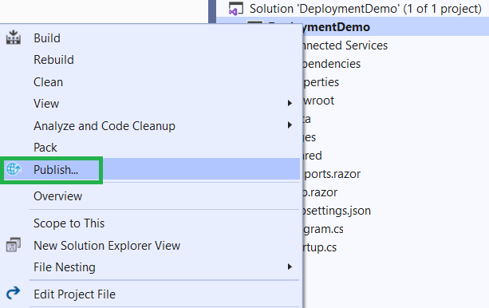

# Deployment

This section provides information about deploying applications with the Syncfusion Blazor components.

You can get more information about deploying Blazor applications [Here](https://docs.microsoft.com/en-us/aspnet/core/host-and-deploy/blazor/).

## Publish Blazor Application with Visual Studio 2019

* Create the blazor Application with [Syncfusion components](https://ej2.syncfusion.com/blazor/documentation/introduction/).

> Note: Need to change the base path of the application. Refer to the [MSDN](https://docs.microsoft.com/en-us/aspnet/core/host-and-deploy/blazor/?view=aspnetcore-3.1&tabs=visual-studio#app-base-path) for this.

* Right click the project name in `Solution Explorer` and select `Publish`.



* Then, select the `Folder` option and select the publishing target location.


* Check the configuration as Release by clicking the `Advanced...` option below the target location.


>Note : For `Blazor Server Application`, Deployment Mode is set to
`Self-Contained`.

Because some dependencies are not loaded properly when we host the published folder.

* Then, click `Save` and `Publish`.

> Refer [here](https://docs.microsoft.com/en-us/visualstudio/deployment/quickstart-deploy-to-azure?view=vs-2019) for publishing the application to Azure App Service using Visual Studio.  

## Publish Blazor Application with CLI

Packing the application and its dependencies into a folder for deployment to a hosting system by using the `dotnet publish` command.

For CLI deployment, run the following command from your root directory.

```bash
    dotnet publish -c Release
````

For Blazor Server CLI deployment,

```bash
    dotnet publish -c Release --self-contained true -r win-x86
````
Refer to the dotnet publish\'s [optional arguments](https://docs.microsoft.com/en-us/dotnet/core/tools/dotnet-publish?tabs=netcore21#arguments). 

### Output location

Use the following command to specify the path for the output directory.

```bash
    dotnet publish -c Release -o <output directory>
```
> If the output directory not specified, it defaults to `./bin/[configuration]/[framework]/publish/` for a **framework-dependent deployment** or `./bin/[configuration]/[framework]/[runtime]/publish/` for a **self-contained deployment**.

If the path is relative, the output directory generated is relative to the project file location, not to the current working directory.

Also refer to the MSDN reference [here](https://docs.microsoft.com/en-us/aspnet/core/host-and-deploy/azure-apps/?view=aspnetcore-3.1&tabs=netcore-cli#deploy-the-app-self-contained).

Now, you can host the published folder by using IIS or Azure app service.

## See Also

* [Host and Deploy blazor](https://docs.microsoft.com/en-us/aspnet/core/host-and-deploy/blazor/?view=aspnetcore-3.1&tabs=visual-studio)
* [Host and deploy blazor server](https://docs.microsoft.com/en-us/aspnet/core/host-and-deploy/blazor/server?view=aspnetcore-3.1)
* [Host and deploy ASP.NET Core Blazor WebAssembly](https://docs.microsoft.com/en-us/aspnet/core/host-and-deploy/blazor/webassembly?view=aspnetcore-3.1)
* [Publish a Web app to Azure App Service using Visual Studio](https://docs.microsoft.com/en-us/visualstudio/deployment/quickstart-deploy-to-azure?view=vs-2019)
* [Deploy ASP.NET Core apps to Azure App Service](https://docs.microsoft.com/en-us/aspnet/core/host-and-deploy/azure-apps/?view=aspnetcore-3.1&tabs=visual-studio)