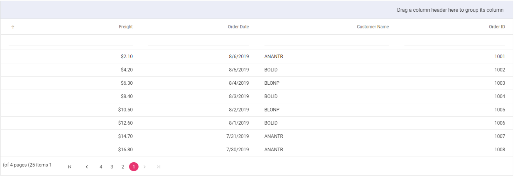

# Right-To-Left

The right-to-left (RTL) supports can be enabled for Syncfusion Blazor components by setting `EnableRtl` to `true`. This will render all the Syncfusion Blazor components in the right-to-left direction.

## Enable RTL to individual component

To control a component’s direction, set the component’s `EnableRtl` property to true directly. For illustration, the RTL support has been enabled for DropDownList component in the following code snippet.

```csharp

@using Syncfusion.EJ2.Blazor.DropDowns

<EjsDropDownList TValue="string" Placeholder="Select the country" TItem="Countries" DataSource="@CountryList" EnableRtl="true">
    <DropDownListFieldSettings Text="Name" Value="Code"></DropDownListFieldSettings>
</EjsDropDownList>

@code {

    EjsDropDownList<string, Countries> dropdownObj;

    public class Countries
    {
        public string Name { get; set; }

        public string Code { get; set; }
    }
    List<Countries> CountryList = new List<Countries>
    {
        new Countries() { Name = "Australia", Code = "AU" },
        new Countries() { Name = "Bermuda", Code = "BM" },
        new Countries() { Name = "Canada", Code = "CA" },
        new Countries() { Name = "Cameroon", Code = "CM" }
    };
}

```

After the successful compilation, press F5 to run the application.

The following screenshot illustrates the output.


## Enable RTL for all components

To control the direction of all the components in an application, import `Micsoft.JSInterop`, inject `IJSRuntime` in your `@code`, and use the Base method. In the following code snippet, the RTL support has been enabled for all the components.

```csharp

@using Microsoft.JSInterop
@using Syncfusion.EJ2.Blazor.Grids

<EjsGrid DataSource="@Orders" AllowPaging="true" AllowSorting="true" AllowFiltering="true" AllowGrouping="true" EnablePersistence="true">
    <GridPageSettings PageSize="8"></GridPageSettings>
    <GridColumns>
        <GridColumn Field=@nameof(Order.OrderID) HeaderText="Order ID" TextAlign="TextAlign.Right" Width="100"></GridColumn>
        <GridColumn Field=@nameof(Order.CustomerID) HeaderText="Customer Name" Width="120"></GridColumn>
        <GridColumn Field=@nameof(Order.OrderDate) HeaderText=" Order Date" Format="d" Type="ColumnType.Date" TextAlign="TextAlign.Right" Width="100"></GridColumn>
        <GridColumn Field=@nameof(Order.Freight) HeaderText="Freight" Format="C2" TextAlign="TextAlign.Right" Width="120"></GridColumn>
    </GridColumns>
</EjsGrid>

@code {
    [Inject]
    IJSRuntime JsRuntime { get; set; }
    public List<Order> Orders { get; set; }

    protected override async Task OnInitializedAsync()
    {
        await base.OnInitializedAsync();
        Orders = Enumerable.Range(1, 25).Select(x => new Order()
        {
            OrderID = 1000 + x,
            CustomerID = (new string[] { "ALFKI", "ANANTR", "ANTON", "BLONP", "BOLID" })[new Random().Next(5)],
            Freight = 2.1 * x,
            OrderDate = DateTime.Now.AddDays(-x),
        }).ToList();

        //Set EnableRtl to all Syncfusion Blazor Components
        this.JsRuntime.Ejs().EnableRtl(true);
    }

    public class Order
    {
        public int? OrderID { get; set; }
        public string CustomerID { get; set; }
        public DateTime? OrderDate { get; set; }
        public double? Freight { get; set; }
    }
}

```


