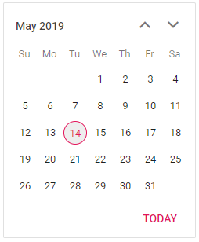

<!-- markdownlint-disable MD024 -->

## Getting Started with Essential JS 2 for Razor Components in .NET Core CLI

This article provides a step-by-step introduction to configure Essential JS 2 setup, build and publish a simple .NET Core Razor Components web application using the [.Net Core CLI](https://visualstudio.microsoft.com/vs/preview/).

> Blazor is an unsupported, experimental web framework that shouldn't be used for production workloads at this time.

## Prerequisites

The official prerequisites to create and run an ASP.NET Core Blazor on Windows environment are described in the [.NET Core Razor Components documentation website](https://docs.microsoft.com/en-us/aspnet/core/razor-components/get-started?view=aspnetcore-3.0&tabs=netcore-cli).

* [.NET Core SDK 3.0 Preview](https://dotnet.microsoft.com/download/dotnet-core/3.0)

## Create a Razor Components in .NET Core CLI

1. To create the Razor Components application, run the following command.
  
    ```cshtml
        dotnet new razorcomponents -o WebApplication1
        cd WebApplication1
    ```

## Importing Essential JS 2 Razor components in the application

1. Now, add the **Syncfusion.EJ2.AspNet.Core.RazorComponents** NuGet package to the new application using below command

    ```cshtml
        dotnet add package Syncfusion.EJ2.AspNet.Core.RazorComponents
        dotnet restore
    ```

2. The Essential JS 2 package will be included in the project, after the installation process is completed.

3. Open **~/_ViewImports.cshtml** file and import the `Syncfusion.EJ2.RazorComponents`.

    ```cshtml
    @addTagHelper *, Syncfusion.EJ2.RazorComponents
    ```

4. Add the client-side resources through CDN or local npm package in the `<head>` element of the **~/wwwroot/index.html** page.

    

5. Now, add the Syncfusion Essential JS 2 components in any web page (cshtml) in the `Pages` folder. For example, the calendar component is added in the **~/Pages/Index.cshtml** page.

    ```cshtml
    <EjsCalendar ID="test"></EjsCalendar>
    ```

6. Run `dotnet run` command to run the application. The Essential JS 2 calendar component will render in the web browser.

    
